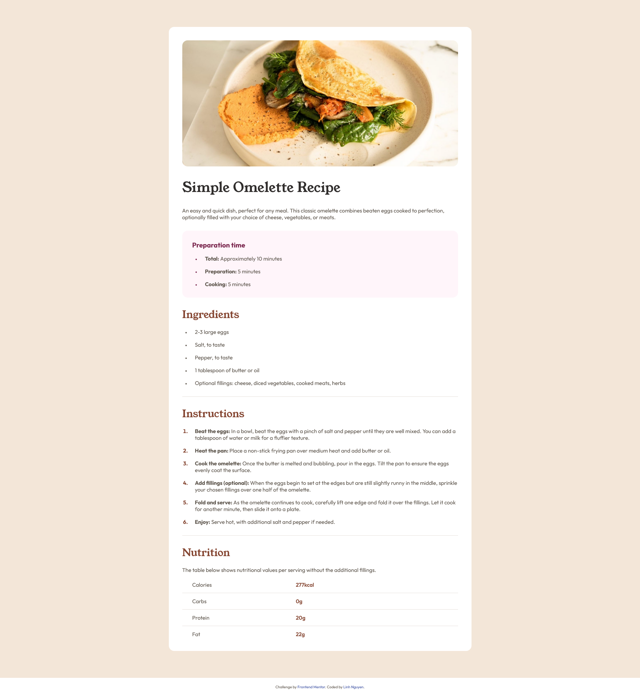
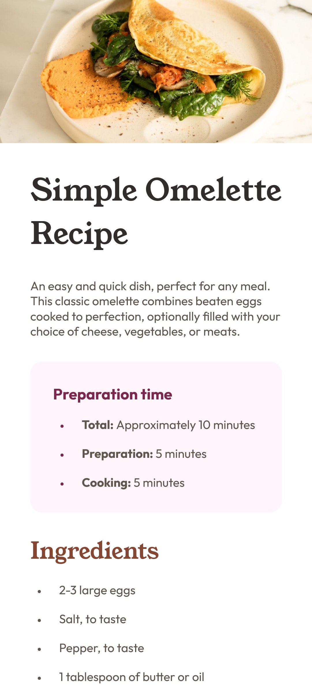

# Frontend Mentor - Recipe page solution

## Table of contents

- [Overview](#overview)
  - [The challenge](#the-challenge)
  - [Screenshot](#screenshot)
  - [Links](#links)
- [My process](#my-process)
  - [Built with](#built-with)
  - [What I learned](#what-i-learned)
  - [Continued development](#continued-development)
  - [Useful resources](#useful-resources)
- [Author](#author)
- [Acknowledgments](#acknowledgments)

## Overview

### Screenshot

_1. Desktop design_



_2. Mobile design_



### Links

<!-- - Solution URL: [Add solution URL here](https://your-solution-url.com) -->
- Live Site URL: [Add live site URL here](https://your-live-site-url.com)

## My process

### Built with

- Semantic HTML5 markup
- CSS custom properties
- Flexbox


### What I learned

- Changing the list's bullet color or font size by using the code below:

```css
ul > li::marker {
  font-size: 12px;
}

.recipe-desc li::marker {
  color: var(--Dark_Raspberry);
}
```

- Because I'm using this structure for showing the image, so when showing on small devices I have to make the image full-width and ignore the padding. Below are the html code and the css code (the CSS code solution for this part I asked ChatGPT): 

```html
  <div class="container">
    <div class="recipe">
      <div class="recipe-img">
        
      </div>
      <h2 class="recipe-title">Simple Omelette Recipe</h2>
      <p class="recipe-intro">
        An easy and quick dish, perfect for any meal. This classic omelette combines beaten eggs cooked to perfection,
        optionally filled with your choice of cheese, vegetables, or meats.
      </p>
      ...
```

```css
@media only screen and (max-width: 912px) {
  .container {
    padding: 0;
    background-color: var(--White);
  }

  .recipe {
    width: 100%;
    padding-top: 0;
    border-radius: none;
  }

  .recipe-img {
    width: calc(100% + 40px);
  }

  .recipe-img img {
    width: calc(100% + 40px);
    margin-left: -40px;
    margin-right: -40px;
    height: auto;
    border-radius: 0;
  }

  .attribution {
    background-color: var(--Eggshell);
  }
}
```

- Styling the table:

```css
.recipe-nutrition table tr td:first-of-type {
  width: 40%;
  padding-left: 30px;
}
.recipe-nutrition table tr td:last-of-type {
  width: 60%;
  font-weight: 600;
  color: var(--Nutmeg);
  padding-left: 10px;
}
```

### Continued development

CSS Grid once again!

### Useful resources

- [W3School](https://www.w3schools.com/howto/howto_css_bullet_color.asp) - How to change CSS bullet color of lists.
- [FreeCodeCamp](https://www.freecodecamp.org/news/media-query-css-example-max-and-min-screen-width-for-mobile-responsive-design/) - This is an amazing article that helped me understand some basics of media query CSS.


## Author

- Frontend Mentor - [@auri222](https://www.frontendmentor.io/profile/auri222)
